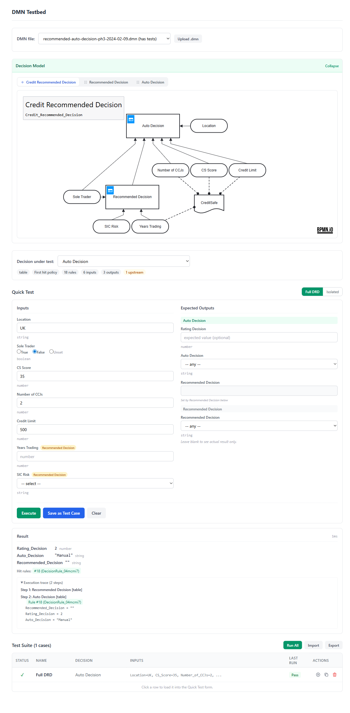
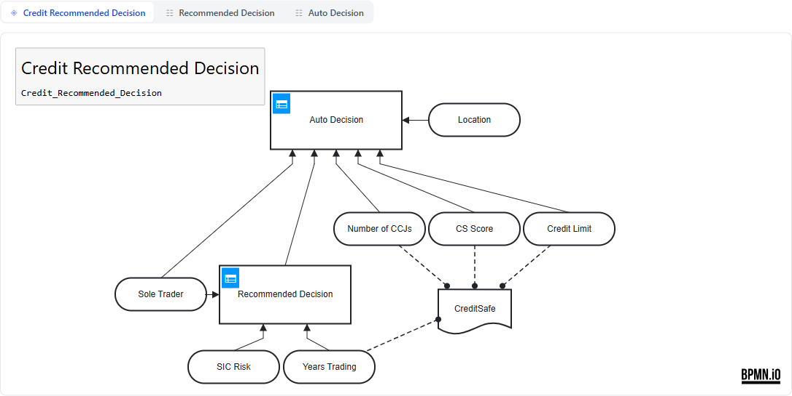
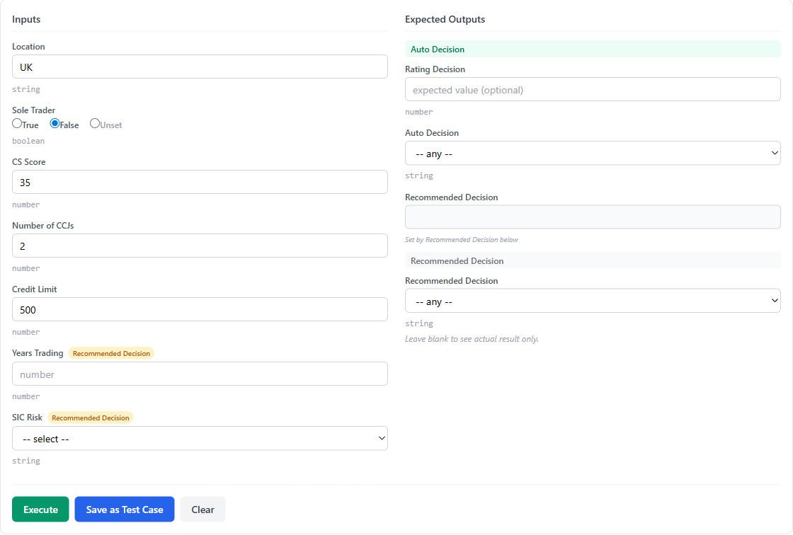
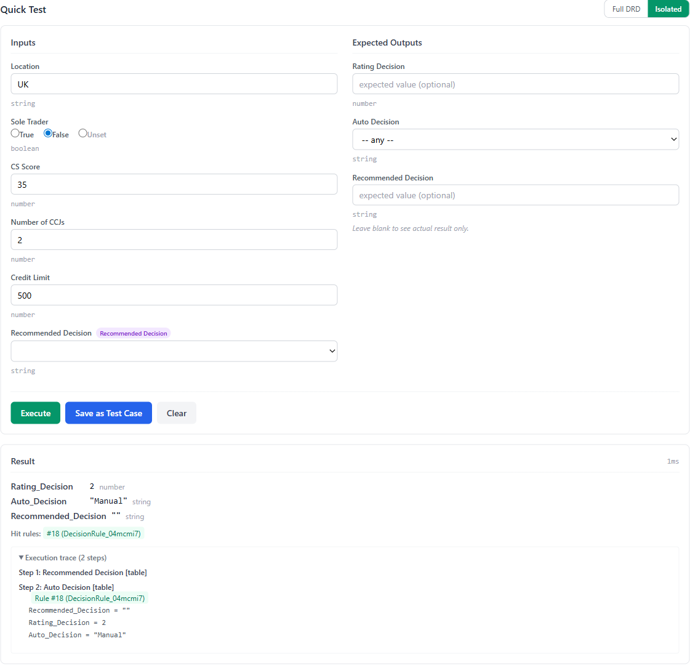
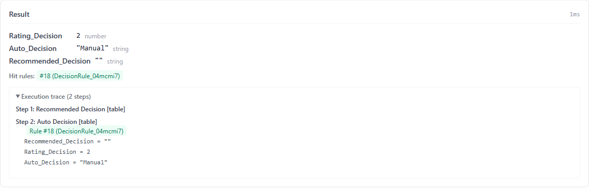
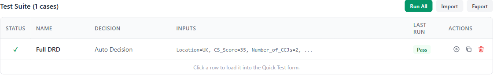
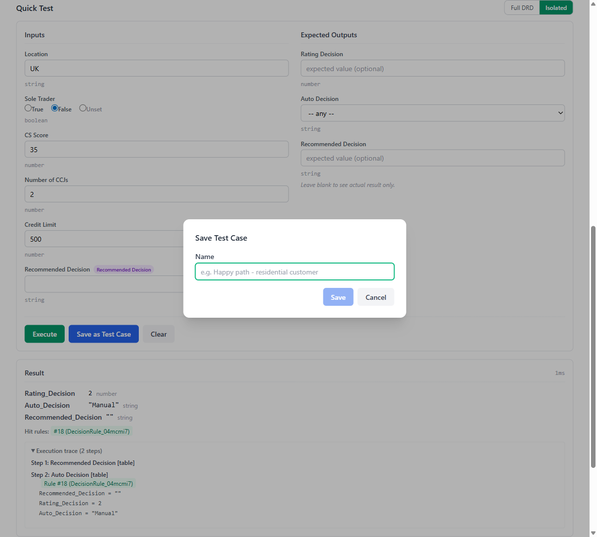

# DMN Testbed

The DMN Testbed is a web-based test lab for interactively executing DMN decisions, testing full Decision Requirements Diagrams (DRDs), and managing regression test suites. It is designed for **local development use** and deliberately does not include authentication — it binds to localhost and is intended to be run on a developer's machine against local DMN files.



## Getting Started

The testbed is a self-contained ASP.NET Core application that serves a Nuxt SPA frontend. Point it at a directory containing `.dmn` files:

```bash
dotnet run --project ScratchyDisk.DmnEngine.Testbed -- --dmn-dir=/path/to/dmn/files
```

Then open `http://localhost:5000` in a browser.

The `--dmn-dir` argument defaults to the current directory if omitted. All `.dmn` files in the directory (including subdirectories) are listed in the file selector.

## Development Setup

To develop the frontend with hot reload, start the backend and the Nuxt dev server separately:

```bash
# Terminal 1: backend on port 5000
dotnet run --project ScratchyDisk.DmnEngine.Testbed -- --dmn-dir=/path/to/dmn/files

# Terminal 2: frontend dev server (proxies /api to the backend)
cd ScratchyDisk.DmnEngine.Testbed/client
npm install
npm run dev
```

The Nuxt dev server proxies API requests (`/api/*`) to the backend on port 5000, configured in `nuxt.config.ts`.

To build the frontend for production (output goes to `wwwroot/` so the backend serves it directly):

```bash
cd ScratchyDisk.DmnEngine.Testbed/client
npm run generate
```

The MSBuild target only runs the client build when `wwwroot/index.html` does not already exist. To force a rebuild, delete the `wwwroot/` directory and rebuild the project.

## Interface Walkthrough

### File Selector and Upload

At the top of the page, select a DMN file from the dropdown or upload a new `.dmn` file using the **Upload .dmn** button. Files with existing test suites are annotated with "(has tests)".

### File Metadata Bar

When a file is loaded, a row of badges appears below the file selector showing metadata extracted from the DMN XML `<definitions>` element:

- **DMN version** (blue badge) — the specification version detected from the XML namespace (e.g. "DMN 1.3")
- **Definition name** — the `name` attribute of the root `<definitions>` element
- **Exporter** — the tool that exported the file and its version (e.g. "Camunda Modeler v5.43.1")
- **Execution platform** — the target runtime set by the modeler, from the Camunda `modeler:executionPlatform` attribute (e.g. "Camunda Cloud 8.8.0")
- **Camunda** (orange badge) — shown when the file was exported by a Camunda tool, indicating that V1.3ext parsing rules are applied automatically

Hover over any badge to see a tooltip explaining what the value means and where it comes from.

### Decision Model Viewer

When a file is loaded, the **Decision Model** section shows an interactive DRD visualisation powered by [bpmn.io](https://bpmn.io). This displays decision tables, expression decisions, input data nodes, and their dependencies.



The viewer includes:
- **View tabs** for each decision (DRD view and individual table/expression views)
- **Zoom controls** and search
- **Definition name and ID** displayed in the bottom bar
- The panel is collapsible via the Collapse/Expand toggle

### Decision Selector

Below the model viewer, select the **Decision under test** from a dropdown. Summary chips show key properties at a glance: decision type (table/expression), hit policy, rule count, input/output counts, and how many upstream decisions are required.

## Quick Test Form

The Quick Test form lets you provide input values, set expected outputs, and execute a decision interactively.



### Inputs Column

The left column shows input fields, automatically rendered based on the variable type:

- **Dropdowns** for inputs with allowed values (enumerated lists from the decision table)
- **True / False / Unset radio buttons** for boolean inputs
- **Number spinners** for numeric types (integer, long, double, number)
- **Date pickers** for date-typed inputs
- **Text fields** for strings and other types

Each field shows its type annotation below (e.g. `string`, `number`, `boolean`).

When testing a decision with upstream dependencies, additional inputs appear with coloured **badges** showing which upstream decision they feed into (e.g. "Recommended Decision"). Hover over the badge to see a tooltip like "Input to Recommended Decision".

### Expected Outputs Column

The right column shows expected output fields, grouped by decision when testing a DRD:

- The **selected decision's outputs** appear first under a green header
- **Upstream decision outputs** appear below under grey headers
- **Pass-through outputs** — where the selected decision simply passes through an upstream value — are shown as read-only with a hint (e.g. "Set by Recommended Decision below")

Leave expected values blank to see actual results only, or set values to get PASS/FAIL verification.

### Action Buttons

- **Execute** — Run the decision and display results
- **Save as Test Case** — Open a dialog to save the current inputs and expected outputs as a named test case
- **Update Test Case** — When a test case is loaded, update it with the current form values
- **Clear** — Reset the form

## Testing DRD Trees

When the selected decision has upstream dependencies, a **Full DRD / Isolated** toggle appears:

### Full DRD Mode

The engine executes the entire decision tree. Upstream decisions are computed automatically from the leaf-level inputs you provide. You only need to fill in the true input data variables — upstream decision outputs are calculated, not entered manually.

Upstream inputs are shown with badges indicating which decision they feed into.

### Isolated Mode

Tests only the selected decision in isolation. Upstream decision outputs appear as regular input fields (with an "output of" badge) so you can manually provide pre-computed values. This is useful for testing a single decision's logic without depending on the correctness of upstream decisions.



## Execution Results

After executing, the result panel shows:



- **Output values** with their names, values, and types
- **PASS / FAIL indicators** when expected outputs were set
- **Hit rules** — which rules matched (rule index and name)
- **Execution time** in milliseconds

When testing a DRD in Full DRD mode, results are grouped by decision, showing which outputs came from which step.

### Execution Trace

Expand the **Execution trace** accordion to see a step-by-step breakdown:
- Each step shows the decision name and type (table/expression)
- Hit rules for that step
- Variable changes — which variables were set or modified

## Test Suite Management

The **Test Suite** section at the bottom manages saved test cases for the current DMN file.



### Creating Test Cases

1. Fill in inputs and expected outputs in the Quick Test form
2. Click **Save as Test Case**
3. Enter a descriptive name in the dialog
4. Click **Save**



When a test case targets a decision with upstream dependencies, the test runner automatically includes outputs from all upstream decisions in the actual results. This means expected values can be set for any output in the DRD, not just the target decision's own outputs.

### Working with Test Cases

- **Click a row** to load the test case into the Quick Test form for editing or re-execution
- **Update Test Case** button appears when a test case is loaded, allowing you to save changes back
- **Run** (play icon) — Execute a single test case
- **Duplicate** (copy icon) — Create a copy of an existing test case
- **Delete** (bin icon) — Remove a test case
- **Run All** — Execute all test cases in the suite

### Import and Export

- **Export JSON** — Download the test suite as a JSON file
- **Export CSV** — Download the test suite as a CSV file with `Name`, `Decision`, input columns, and `expected:` output columns. If variables have allowed values, a `#LOOKUPS` section is appended listing the options per column. Works even with zero test cases to export a template with headers only.
- **Import JSON** — Upload a JSON file to append test cases to the current suite
- **Import CSV** — Upload a CSV file to import rows as test cases. Supports `Name` and `Decision` columns for round-trip with Export CSV. The `#LOOKUPS` section is ignored on import.

## Test Data Persistence

Test cases are stored in `.tests.json` files alongside the DMN files in the `--dmn-dir` directory. For example, if your DMN file is `my-model.dmn`, the test suite is saved as `my-model.dmn.tests.json`.

These files are auto-saved whenever test cases are created, updated, deleted, or run. They can be committed to version control alongside the DMN files for shared regression suites.

## API Reference

The testbed exposes a REST API for programmatic access. All endpoints are prefixed with `/api/dmn`.

| Method | Endpoint | Description |
|--------|----------|-------------|
| `GET` | `/api/dmn` | List all DMN files in the configured directory |
| `GET` | `/api/dmn/xml/{name}` | Get raw DMN XML content for a file |
| `GET` | `/api/dmn/info/{name}` | Get parsed definition info (decisions, inputs, outputs, types) and file metadata (DMN version, exporter, execution platform) |
| `POST` | `/api/dmn/execute/{name}` | Execute a decision with provided inputs |
| `GET` | `/api/dmn/tests/{name}` | Load the test suite for a DMN file |
| `PUT` | `/api/dmn/tests/{name}` | Save (replace) the test suite for a DMN file |
| `POST` | `/api/dmn/tests/run/{name}` | Run test cases and return results |
| `POST` | `/api/dmn/upload/{name}` | Upload a DMN file (multipart form or raw XML body) |
| `POST` | `/api/dmn/batch-test-csv/{name}?decisionName=X` | Batch test a decision using CSV data (multipart form or raw CSV body) |
| `POST` | `/api/dmn/tests/import-csv/{name}?decisionName=X` | Import CSV rows as test cases into the test suite |

The `{name}` parameter is the file path relative to `--dmn-dir` and supports subdirectories (e.g. `subfolder/my-model.dmn`).

### Example: Execute a Decision

```bash
curl -X POST http://localhost:5000/api/dmn/execute/my-model.dmn \
  -H "Content-Type: application/json" \
  -d '{
    "decisionName": "Auto Decision",
    "inputs": {
      "Location": "UK",
      "Sole_Trader": false,
      "CS_Score": 35
    }
  }'
```

### Example: Run All Tests

```bash
curl -X POST http://localhost:5000/api/dmn/tests/run/my-model.dmn \
  -H "Content-Type: application/json" \
  -d '{}'
```

To run specific test cases, provide their IDs:

```bash
curl -X POST http://localhost:5000/api/dmn/tests/run/my-model.dmn \
  -H "Content-Type: application/json" \
  -d '{"testCaseIds": ["id-1", "id-2"]}'
```

### Example: Upload a DMN File

```bash
curl -X POST http://localhost:5000/api/dmn/upload/my-model.dmn \
  -F "file=@my-model.dmn"
```

### Example: CSV Batch Test

Execute a decision against each row in a CSV file. Columns map to input variables. Add `expected:` prefix to columns for pass/fail validation.

```bash
curl -X POST "http://localhost:5000/api/dmn/batch-test-csv/my-model.dmn?decisionName=Auto%20Decision" \
  -F "file=@test-data.csv"
```

CSV format (execute-only):
```csv
Location,Sole_Trader,CS_Score
UK,false,35
US,true,80
```

CSV format (with expected output validation):
```csv
Location,Sole_Trader,CS_Score,expected:Result
UK,false,35,Decline
US,true,80,Accept
```

Response includes per-row results and a summary:
```json
{
  "dmnFile": "my-model.dmn",
  "decisionName": "Auto Decision",
  "mode": "test",
  "summary": { "totalRows": 2, "passed": 1, "failed": 1, "errors": 0 },
  "rows": [
    { "rowNumber": 1, "status": "pass", "actualOutputs": { "Result": { "value": "Decline", "typeName": "string" } } },
    { "rowNumber": 2, "status": "fail", "actualOutputs": { "Result": { "value": "Refer", "typeName": "string" } }, "failureDetails": { "Result": "Expected 'Accept' but got 'Refer'" } }
  ],
  "warnings": [],
  "totalTimeMs": 42
}
```

See [CSV Batch Testing Guide](csv-batch-testing.md) for detailed documentation including Katalon integration.

### Example: Import CSV as Test Cases

Import CSV rows as test cases into the existing test suite:

```bash
curl -X POST "http://localhost:5000/api/dmn/tests/import-csv/my-model.dmn?decisionName=Auto%20Decision" \
  -F "file=@test-data.csv"
```

The CSV format is the same as batch testing. Each row becomes a test case with an auto-generated name ("Row 1", "Row 2", etc.). Imported cases are appended to the existing suite.

### CSV Import in the UI

The test suite section includes an **Import CSV** button alongside the JSON import. Click it, select a `.csv` file, and the rows are imported as test cases for the currently selected decision.
