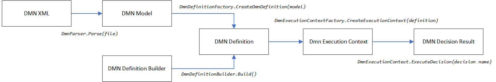

# ScratchyDisk.DmnEngine

A .NET rule engine that executes decisions defined in [DMN (Decision Model and Notation)](https://www.omg.org/spec/DMN/) models. It evaluates decision tables and expression decisions from OMG-standard DMN XML files (versions 1.1, 1.3, 1.3ext, 1.4, 1.5), or from definitions built programmatically using a fluent API. Expressions are evaluated using a full [FEEL](https://www.omg.org/spec/DMN/) (Friendly Enough Expression Language) interpreter built on ANTLR4.

**NuGet package ID:** `ScratchyDisk.DmnEngine`
**Target framework:** .NET 10.0
**Licence:** MIT

See the latest changes in the [changelog](changelog.md).

## Features

- **Full FEEL evaluator** — ANTLR4-based lexer, parser, and tree-walking interpreter supporting the complete FEEL expression language, including `if`/`then`/`else`, `for`/`in`/`return`, `some`/`every` quantifiers, list/context operations, ranges, and ~80 built-in functions
- **DMN 1.1 through 1.5** — auto-detects the DMN version from the XML namespace
- **Decision tables** with all standard hit policies (Unique, First, Priority, Any, Collect, RuleOrder, OutputOrder)
- **Expression decisions** — single FEEL expression producing an output
- **Decision requirement graphs (DRDs)** — complex models with dependent decisions resolved automatically
- **Fluent builder API** — create decision definitions programmatically without XML
- **CLR interop** — call .NET instance and static methods from FEEL expressions for backward compatibility
- **Expression caching** — parsed AST nodes cached at configurable scope (Execution, Context, Definition, Global)
- **Thread-safe definitions** — definitions are immutable after creation, safe for concurrent execution contexts
- **Web-based testbed** — interactive test lab with regression test suite management
- **CLI tool** — `dmnrunner` for batch execution and CI integration

## Quick Start

```csharp
var def = DmnParser.Parse(fileName);
var ctx = DmnExecutionContextFactory.CreateExecutionContext(def);
ctx.WithInputParameter("input name", inputValue);
var result = ctx.ExecuteDecision("decision name");
```



## Tools

- **[DMN Testbed](docs/testbed.md)** — A web-based test lab for interactively executing decisions, testing full DRD trees, and managing regression test suites. Start it with `dotnet run --project ScratchyDisk.DmnEngine.Testbed -- --dmn-dir=/path/to/dmn/files` and open `http://localhost:5000`.
- **[CLI Tool](docs/cli-tool.md)** — `dmnrunner` command-line tool for batch execution and CI integration.

## Architecture

### Core Pipeline

```
DMN XML --> DmnParser --> DmnModel --> DmnDefinitionFactory --> DmnDefinition --> DmnExecutionContextFactory --> DmnExecutionContext
                                                                                                                    |
Code --> DmnDefinitionBuilder --> DmnDefinition ------------------------------------------------------------------>-+
```

1. **Parsing** (`parser/`): `DmnParser` deserialises DMN XML (v1.1, 1.3, 1.3ext, 1.4, 1.5) into `DmnModel` DTOs. Supports auto-detection of DMN version from the XML namespace.
2. **Definition** (`engine/definition/`): `DmnDefinitionFactory` transforms `DmnModel` into `DmnDefinition` — validation, variable type resolution, and dependency tree construction. Definitions are "virtually immutable" (exposed via read-only interfaces).
3. **Builder** (`engine/definition/builder/`): `DmnDefinitionBuilder` provides a fluent API to create `DmnDefinition` programmatically without XML.
4. **Decisions** (`engine/decisions/`): Two types — `DmnExpressionDecision` (single expression to output) and `DmnDecisionTable` (rules with inputs, outputs, hit policies).
5. **Execution** (`engine/execution/`): `DmnExecutionContext` manages variables, resolves decision dependencies recursively, evaluates expressions via the FEEL evaluator, and returns `DmnDecisionResult`.

### FEEL Evaluator Pipeline

```
FEEL expression string
  --> FeelLexer.g4 --> Token stream
  --> FeelNameResolver --> Merged tokens (multi-word names resolved)
  --> FeelParser.g4 --> Parse tree
  --> FeelAstBuilder --> FeelAstNode (AST)
  --> FeelEvaluator --> Result value
```

- **Grammar** (`feel/grammar/`): `FeelLexer.g4` and `FeelParser.g4` — ANTLR4 grammars compiled at build time via `Antlr4BuildTasks`
- **Parsing** (`feel/parsing/`): `FeelScope` (variable/function name registry), `FeelNameResolver` (multi-word identifier merging), `FeelAstBuilder` (parse tree to AST)
- **AST** (`feel/ast/`): `FeelAstNode` hierarchy — literals, operators, control flow, collections, functions, unary tests
- **Evaluation** (`feel/eval/`): `FeelEvaluationContext` (variable scope chain) and `FeelEvaluator` (tree-walking interpreter with three-valued logic)
- **Functions** (`feel/functions/`): ~80 built-in FEEL functions (string, numeric, list, date/time, context, range, boolean, conversion)
- **Types** (`feel/types/`): `FeelTime`, `FeelYmDuration`, `FeelRange`, `FeelContext`, `FeelFunction`, `FeelTypeCoercion`, `FeelValueComparer`
- **Facade** (`feel/FeelEngine.cs`): Public API — `EvaluateExpression()`, `EvaluateSimpleUnaryTests()`, `ParseExpression()`, `ParseSimpleUnaryTests()`

### FEEL Type Mappings

| FEEL Type | .NET Type |
|-----------|-----------|
| `number` | `decimal` |
| `string` | `string` |
| `boolean` | `bool` |
| `date` | `DateOnly` |
| `time` | `FeelTime` |
| `date and time` | `DateTimeOffset` |
| `years and months duration` | `FeelYmDuration` |
| `days and time duration` | `TimeSpan` |
| `list` | `List<object>` |
| `context` | `FeelContext` |
| `range` | `FeelRange` |
| `function` | `FeelFunction` |

### Key Design Patterns

- **Virtual immutability**: Definitions are effectively immutable after creation (hidden behind read-only interfaces like `IDmnVariable`, `IDmnDefinition`). Safe for concurrent access.
- **Factory pattern**: `DmnDefinitionFactory` and `DmnExecutionContextFactory` are the primary creation points. `DmnDefinitionFactory` has virtual protected methods for subclassing.
- **Expression caching**: Parsed FEEL AST nodes (`FeelAstNode`) are cached with configurable scope (None, Execution, Context, Definition, Global) via `ParsedExpressionCacheScopeEnum`. AST nodes are immutable and thread-safe.
- **CLR interop**: The FEEL evaluator supports CLR instance method calls (e.g. `.ToString()`) and static method calls (e.g. `double.Parse()`, `Math.Abs()`) for backward compatibility.

### Decision Table Hit Policies

Unique, First, Priority, Any, Collect (with aggregations: List, Sum, Min, Max, Count), RuleOrder, OutputOrder.

### Dependencies

- **Antlr4.Runtime.Standard** 4.13.1 — ANTLR4 runtime for FEEL parser
- **Antlr4BuildTasks** 12.8 — Build-time grammar compilation (private asset)
- **NLog** 5.3.4 — Logging

## Build and Test

```bash
# Build the solution
dotnet build ScratchyDisk.DmnEngine.sln

# Run all tests (4,100+)
dotnet test ScratchyDisk.DmnEngine.Tests/ScratchyDisk.DmnEngine.Tests.csproj

# Run a single test by name
dotnet test ScratchyDisk.DmnEngine.Tests/ScratchyDisk.DmnEngine.Tests.csproj --filter "FullyQualifiedName~TestMethodName"
```

Tests are implemented using [MSTest](https://github.com/microsoft/testfx) with [FluentAssertions](https://fluentassertions.com/). The test code is in a shared project linked into the consolidated test project `ScratchyDisk.DmnEngine.Tests` targeting .NET 10.0.

`DmnTestBase` provides abstraction for running the same tests against different sources (DMN XML 1.1/1.3/1.3ext/1.4/1.5 or builders). Primary test classes inherit from `DmnTestBase` and contain test logic targeting DMN XML 1.1. Derived classes override the `Source` property to reuse the same tests against other DMN versions and builder-based definitions. `DmnBuilderSamples` is generated from DMN XML test models using the builder API.

> **Note:** Adjust the `LogHome` variable in `nlog.config` of the test project as needed.

## DMN Testbed

The testbed is a web-based test lab for interactively executing DMN decisions and managing test suites. It serves a Nuxt SPA frontend from an ASP.NET Core backend that wraps the engine.

```bash
# Start the testbed, pointing it at a directory of .dmn files
dotnet run --project ScratchyDisk.DmnEngine.Testbed -- --dmn-dir=/path/to/dmn/files
```

Then open `http://localhost:5000` in a browser. The `--dmn-dir` argument defaults to the current directory if omitted.

To develop the frontend with hot reload, start the backend and the Nuxt dev server separately:

```bash
# Terminal 1: backend on port 5000
dotnet run --project ScratchyDisk.DmnEngine.Testbed -- --dmn-dir=/path/to/dmn/files

# Terminal 2: frontend dev server (proxies /api to the backend)
cd ScratchyDisk.DmnEngine.Testbed/client
npm install
npm run dev
```

To build the frontend for production (output goes to `wwwroot/` so the backend serves it directly):

```bash
cd ScratchyDisk.DmnEngine.Testbed/client
npm run generate
```

## Documentation

| Document | Description |
|----------|-------------|
| [Decision Model](docs/decision-model.md) | Parsing DMN XML, DmnDefinitionBuilder, inputs, decisions, dependency tree |
| [Variables](docs/variables.md) | Variable names, types, normalisation, complex objects |
| [Expressions](docs/expressions.md) | FEEL expressions, simple unary tests, built-in functions |
| [Expression Decisions](docs/expression-decisions.md) | Expression decisions in XML and via builder |
| [Decision Tables](docs/decision-tables.md) | Inputs, outputs, rules, SFeel helper, allowed values, hit policies |
| [Decision Results](docs/decision-results.md) | Working with DmnDecisionResult |
| [Extensions](docs/extensions.md) | Definition extensions and diagram extensions |
| [Advanced Execution](docs/advanced-execution.md) | Execution context options, snapshots, expression cache |
| [CLI Tool](docs/cli-tool.md) | dmnrunner command-line tool for testing DMN files |
| [Testbed](docs/testbed.md) | Web-based test lab for DMN files |

## Acknowledgements

This project originated as a fork of [Common.DMN.Engine](https://github.com/adamecr/Common.DMN.Engine) (v1.1.1) by Radek Adamec. The v2.0 release replaced the expression evaluation engine entirely (DynamicExpresso with a custom ANTLR4-based FEEL interpreter), added DMN 1.4/1.5 support, introduced FEEL-native types, a web-based testbed, a CLI tool, and 4,100+ tests. See the [changelog](changelog.md) for the full list of changes.
